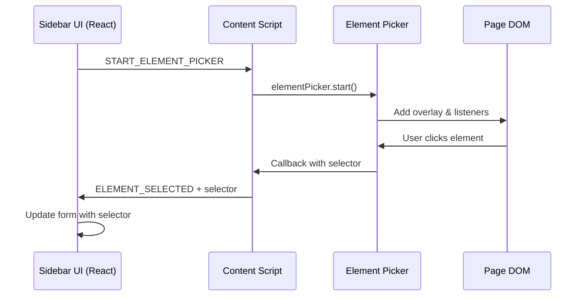
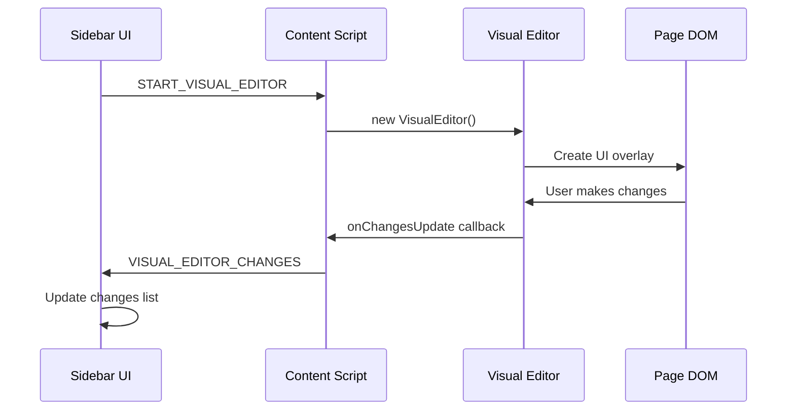

# Extension Communication Architecture

## Overview

The ABSmartly Browser Extension uses Chrome's message passing API for secure communication between different components. This document explains the architecture and message flow between the sidebar UI, content scripts, and background script.

## Architecture Components

### 1. Execution Contexts

The extension operates in multiple isolated execution contexts:

| Context | Description | Access | Isolation |
|---------|-------------|--------|-----------|
| **Background Script** | Service worker that handles extension lifecycle | Chrome APIs, Network requests | Completely isolated |
| **Content Script** | Injected into web pages | Page DOM (read/write), Chrome messaging | Isolated JavaScript context |
| **Sidebar UI** | React app in Shadow DOM | Chrome storage, messaging | Runs in extension context |
| **Web Page** | The actual website | Page JavaScript, DOM | Cannot access extension directly |

### 2. Why Message Passing is Required

Even though the sidebar is injected into the page DOM, **direct JavaScript communication is impossible** due to Chrome's security model:

- **Isolated Worlds**: Content scripts run in an "isolated world" - they share the DOM with the page but have completely separate JavaScript contexts
- **Security Boundary**: This prevents malicious websites from accessing extension APIs or data
- **Context Separation**: The sidebar React app and content script cannot call each other's functions directly

## Message Flow Diagrams

### Element Picker Flow



### Visual Editor Flow



## Message Types

### Content Script Messages (Incoming)

| Message Type | Purpose | Payload | Response |
|--------------|---------|---------|----------|
| `TEST_CONNECTION` | Verify content script is loaded | `{ fromPopup: true }` | `{ success: true, message: string }` |
| `START_ELEMENT_PICKER` | Start element selection mode | `{ fromPopup: true }` | `{ success: true }` |
| `CANCEL_ELEMENT_PICKER` | Cancel element selection | None | `{ success: true }` |
| `START_VISUAL_EDITOR` | Launch visual editor | `{ variantName, changes }` | `{ success: true/false }` |
| `STOP_VISUAL_EDITOR` | Stop visual editor | None | `{ success: true, changes }` |

### Content Script Messages (Outgoing)

| Message Type | Purpose | Payload |
|--------------|---------|---------|
| `ELEMENT_SELECTED` | Send selected element selector | `{ type: 'ELEMENT_SELECTED', selector: string }` |
| `VISUAL_EDITOR_CHANGES` | Send updated DOM changes | `{ type: 'VISUAL_EDITOR_CHANGES', variantName: string, changes: DOMChange[] }` |

### Background Script Messages

| Message Type | Purpose | Payload |
|--------------|---------|---------|
| `OPEN_SIDEBAR` | Open/toggle sidebar | `{ tabId: number }` |
| `PREVIEW_CHANGES` | Apply preview to page | `{ action: 'apply'/'remove', changes }` |

## Implementation Details

### 1. Message Sending (Sidebar → Content Script)

```typescript
// In DOMChangesInlineEditor.tsx
chrome.tabs.query({ active: true, currentWindow: true }, async (tabs) => {
  if (tabs[0]?.id) {
    // Test connection first
    chrome.tabs.sendMessage(tabs[0].id, { 
      type: 'TEST_CONNECTION',
      fromPopup: true
    }, (response) => {
      if (chrome.runtime.lastError) {
        console.error('Content script not loaded')
        return
      }
      
      // Send actual message
      chrome.tabs.sendMessage(tabs[0].id, { 
        type: 'START_ELEMENT_PICKER',
        fromPopup: true
      })
    })
  }
})
```

### 2. Message Receiving (Content Script)

```typescript
// In content.ts
chrome.runtime.onMessage.addListener((message, sender, sendResponse) => {
  console.log('[Content Script] Received:', message.type)
  
  if (message.type === 'START_ELEMENT_PICKER') {
    if (!elementPicker) {
      elementPicker = new ElementPicker()
    }
    
    elementPicker.start((selector: string) => {
      // Send result back to extension
      chrome.runtime.sendMessage({
        type: 'ELEMENT_SELECTED',
        selector: selector
      })
    })
    
    sendResponse({ success: true })
    return true // Keep channel open for async response
  }
})
```

### 3. Message Receiving (Sidebar)

```typescript
// In DOMChangesInlineEditor.tsx
useEffect(() => {
  const handleElementSelected = (message: any) => {
    if (message.type === 'ELEMENT_SELECTED' && message.selector) {
      // Update the form with selected selector
      setEditingChange({ 
        ...editingChange, 
        selector: message.selector 
      })
      setPickingForField(null)
    }
  }
  
  chrome.runtime.onMessage.addListener(handleElementSelected)
  return () => {
    chrome.runtime.onMessage.removeListener(handleElementSelected)
  }
}, [pickingForField, editingChange])
```

## Alternative Communication Methods (Not Recommended)

### window.postMessage
- **Pros**: Works across contexts
- **Cons**: Less secure, any page script can intercept, requires origin validation

### Custom DOM Events
- **Pros**: Can work through shared DOM
- **Cons**: Complex to implement, less secure, can be intercepted by page

### Shared DOM Elements
- **Pros**: Simple for basic data
- **Cons**: Hacky, unreliable for complex data, synchronization issues

## Best Practices

1. **Always Test Connection**: Before sending critical messages, verify the content script is loaded
2. **Use Typed Messages**: Define TypeScript interfaces for all message types
3. **Handle Errors**: Always check `chrome.runtime.lastError` 
4. **Return True for Async**: Return `true` from listeners when using `sendResponse` asynchronously
5. **Clean Up Listeners**: Remove message listeners in React cleanup functions
6. **Validate Sender**: Check `sender.id` matches extension ID for security

## Security Considerations

1. **Never Trust Page Data**: Always validate data coming from content scripts
2. **Sanitize Selectors**: CSS selectors from the page should be validated
3. **Limit API Access**: Content scripts should have minimal permissions
4. **Use Session Storage**: For temporary data that shouldn't persist
5. **Validate Origins**: When using postMessage, always validate the origin

## Debugging Tips

1. **Console Logging**: Add detailed logs for all message send/receive
2. **Chrome DevTools**: Use the Extensions panel to inspect background script
3. **Content Script Logs**: Check the page console for content script logs
4. **Message Tracing**: Log with prefixes like `[Sidebar→Content]` for clarity
5. **Error Boundaries**: Wrap message handlers in try-catch blocks

## Common Issues and Solutions

| Issue | Cause | Solution |
|-------|-------|----------|
| "Content script not responding" | Page refreshed after extension loaded | Reload the extension or refresh the page |
| "Message port closed" | Async response without `return true` | Add `return true` to keep channel open |
| Messages not received | Wrong tab ID or restricted URL | Check tab permissions and URL |
| Duplicate messages | Multiple listeners registered | Clean up listeners properly |

## Future Improvements

1. **Message Queue**: Implement retry mechanism for failed messages
2. **Type Safety**: Use a message factory with full TypeScript types
3. **Connection Manager**: Centralized connection state management
4. **Message Logging**: Optional debug mode with full message logging
5. **Performance**: Batch messages when possible to reduce overhead